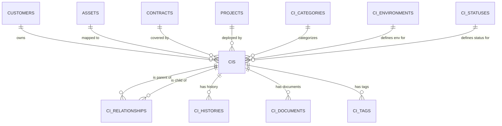

# 04 - Entity Relationship Diagram

```mermaid
erDiagram
    CUSTOMERS ||--o{ CIS : "owns"
    ASSETS ||--o{ CIS : "mapped to"
    CONTRACTS ||--o{ CIS : "covered by"
    PROJECTS ||--o{ CIS : "deployed by"
    
    CI_CATEGORIES ||--o{ CIS : "categorizes"
    CI_ENVIRONMENTS ||--o{ CIS : "defines env for"
    CI_STATUSES ||--o{ CIS : "defines status for"
    
    CIS ||--o{ CI_RELATIONSHIPS : "is parent of"
    CIS ||--o{ CI_RELATIONSHIPS : "is child of"
    
    CIS ||--o{ CI_HISTORIES : "has history"
    CIS ||--o{ CI_DOCUMENTS : "has documents"
    CIS ||--o{ CI_TAGS : "has tags"
```
