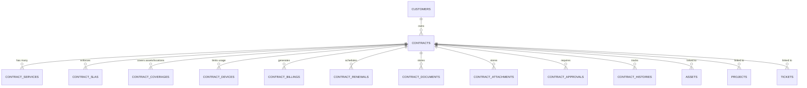

# Enterprise Contract Domain - Documentation

## Entity Relationship Diagram (ERD)

The Contract Domain acts as the central business relationship hub, bridging Customers to specific Services, Devices, Projects, Helpdesk Tickets, and Financial Billing.

## Business Rules

1. **Hierarchy**: A single Customer may possess multiple Contracts (e.g., one for Managed Service, another for Cloud Hosting).
2. **Services**: Contracts encapsulate multiple distinct services (`contract_services`), each with granular flags (e.g., `remoteSupport`, `onsiteSupport`).
3. **SLA Management**: Service Level Agreements (`contract_slas`) dictate specific Response/Resolution times per contract, overriding global Helpdesk SLAs if a ticket belongs to a specific contract.
4. **Coverage & Assets**: A contract explicitly declares which physical locations (`coveredLocation`) or physical assets (`coveredAssetId`) are eligible for support.
5. **Usage Quotas**: Device limits (`contract_devices`) are tracked to prevent over-utilization (e.g., Maximum Users: 50, Current: 48).
6. **Billing Cycles**: Financial schedules are automated within `contract_billings` (Monthly, Quarterly, Yearly) for future ERP Invoicing module consumption.
7. **Cross-Module Linkage**: Assets, Projects, and Tickets now contain a `contract_id` foreign key. This allows the system to determine if a Helpdesk Ticket is billable or covered by an active SLA, or if a Project is part of a larger Retainer Contract.
