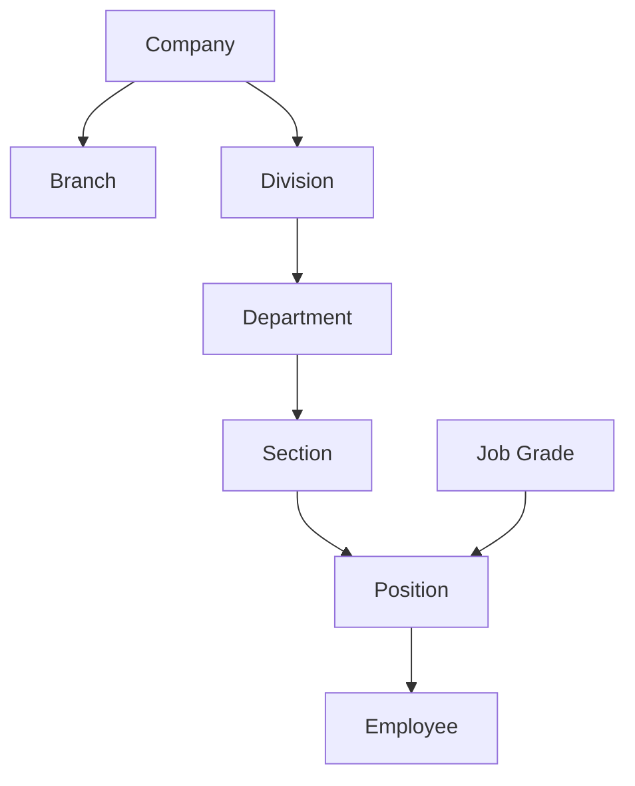
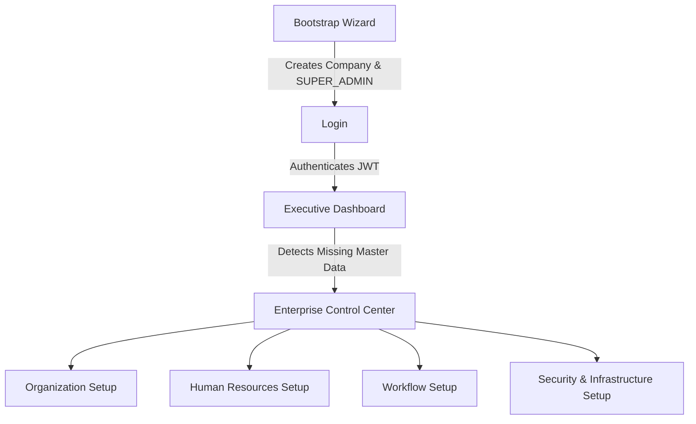

# Master Data Dependency Diagram

```mermaid
graph TD
    A[Company] --> B[Branch]
    A --> C[Division]
    C --> D[Department]
    D --> E[Section]
    E --> F[Position]
    F --> G[Employee]
    
    H[Job Grade] --> F
```

# Application Flow: Bootstrap to Settings

```mermaid
graph TD
    A[Bootstrap Wizard] -->|Creates Company & SUPER_ADMIN| B[Login]
    B -->|Authenticates JWT| C[Executive Dashboard]
    C -->|Detects Missing Master Data| D[Enterprise Control Center]
    D --> E[Organization Setup]
    D --> F[Human Resources Setup]
    D --> G[Workflow Setup]
    D --> H[Security & Infrastructure Setup]
```
